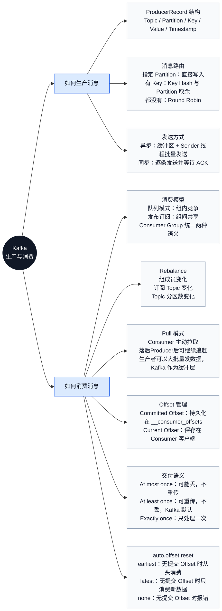

# Kafka从系统架构到生产消费的完整图谱

## Kafka 架构 {id="kafka_1"}

```mermaid
---
config:
  markdownAutoWrap: false
  flowchart:
    useMaxWidth: false
---
flowchart LR
    ROOT1(("Kafka<br/>架构")):::root

    ROOT1 --> BASE["基础模型"]:::topic
    BASE --> BASE_TOPIC["Topic 是逻辑分类"]:::detail
    BASE --> BASE_PARTITION["Partition 是物理分区和并行单位"]:::detail
    BASE --> BASE_REPLICA["Replica 是物理副本，保证 Partition 高可用"]:::detail
    BASE --> BASE_LEADER["Leader 提供对外读写能力，Follower 只是同步副本"]:::detail
    BASE --> BASE_OFFSET["Offset 标识 Partition 内的消息位置"]:::detail

    ROOT1 --> WHY["为什么使用 Kafka"]:::topic
    WHY --> WHY_DECOUPLE["消息队列解耦生产者和消费者"]:::detail
    WHY --> WHY_THROUGHPUT["高吞吐，适合实时日志流"]:::detail
    WHY --> WHY_DURABLE["磁盘持久化，数据不易丢"]:::detail
    WHY --> WHY_SCALE["分布式扩展 Broker 与 Partition"]:::detail

    ROOT1 --> FAST["为什么 Kafka 快"]:::topic
    FAST --> FAST_PARALLEL["Partition 并行<br/>生产消费围绕Partition展开<br/>Partition 数量决定并行上限"]:::detail
    FAST --> FAST_STORAGE["顺序 IO + Segment<br/>Partition 追加写<br/>LogSegment 按最小 Offset 命名"]:::detail
    FAST --> FAST_INDEX["Offset + 稀疏索引<br/>先二分查找定位 Segment<br/>再二分查 Index，找最近 offset<br/>最后顺序扫描 Log"]:::detail
    FAST --> FAST_CACHE["Page Cache<br/>依赖 OS 缓存<br/>减少 JVM 内存和 GC 压力<br/>生产消费速率接近时会形成读写空中接力"]:::detail
    FAST --> FAST_ZERO["Sendfile 零拷贝<br/>数据从Page Cache进入网络的发送路径<br/>减少用户态和内核态复制"]:::detail
    FAST --> FAST_COMPRESS["端到端批量压缩<br/>批次压缩后写入日志<br/>消费前保持压缩<br/>支持 GZIP / Snappy / LZ4"]:::detail

    ROOT1 --> HA["Kafka 高可用"]:::topic
    HA --> HA_REPLICA["Replica 分配<br/>Partition 与 Replica 均匀分布到 Broker<br/>Replica 数量不应超过 Broker 数量"]:::detail
    HA --> HA_ACK["ACK 可靠性<br/>Producer 等待 Broker 确认<br/>确认时机影响吞吐与可靠性"]:::detail
    HA --> HA_ISR["ISR 机制<br/>维护同步副本集合<br/>Follower 长时间落后被踢出 ISR<br/>Leader 故障后从 ISR 中选新 Leader<br/>所有 Follower 同步完成后，Leader 返回 ACK"]:::detail
    HA --> HA_ACK_LEVEL["acks 级别<br/>0：不等确认<br/>1：Leader 写入即确认<br/>all：ISR 同步后确认"]:::detail
    HA --> HA_RECOVER["故障恢复与可见性<br/>LEO 是每个副本末端 Offset<br/>HW 是所有副本最小 LEO<br/>HW 之前数据才对 Consumer 可见"]:::detail

    classDef root fill:#111827,color:#ffffff,stroke:#111827,stroke-width:2px;
    classDef topic fill:#dbeafe,color:#111827,stroke:#2563eb,stroke-width:1.5px;
    classDef detail fill:#f8fafc,color:#0f172a,stroke:#94a3b8,stroke-width:1px;
```

## Kafka 生产与消费 {id="kafka_2"}

```mermaid
---
config:
  markdownAutoWrap: false
  flowchart:
    useMaxWidth: false
---
flowchart LR
    ROOT2(("Kafka<br/>生产与消费")):::root

    ROOT2 --> PRODUCE["如何生产消息"]:::topic
    PRODUCE --> RECORD["ProducerRecord 结构<br/>Topic / Partition / Key / Value / Timestamp"]:::detail
    PRODUCE --> ROUTE["消息路由<br/>指定 Partition：直接写入<br/>有 Key：Key Hash 与 Partition 取余<br/>都没有：Round Robin"]:::detail
    PRODUCE --> SEND["发送方式<br/>异步：缓冲区 + Sender 线程批量发送<br/>同步：逐条发送并等待 ACK"]:::detail

    ROOT2 --> CONSUME["如何消费消息"]:::topic
    CONSUME --> GROUP["消费模型<br/>队列模式：组内竞争<br/>发布订阅：组间共享<br/>Consumer Group 统一两种语义"]:::detail
    CONSUME --> REBALANCE["Rebalance<br/>组成员变化<br/>订阅 Topic 变化<br/>Topic 分区数变化"]:::detail
    CONSUME --> PULL["Pull 模式<br/>Consumer 主动拉取<br/>落后Producer后可继续追赶<br/>生产者可以大批量发数据，Kafka 作为缓冲层"]:::detail
    CONSUME --> OFFSET["Offset 管理<br/>Committed Offset：持久化在 __consumer_offsets<br/>Current Offset：保存在 Consumer 客户端"]:::detail
    CONSUME --> SEMANTICS["交付语义<br/>At most once：可能丢，不重传<br/>At least once：可重传，不丢，Kafka 默认<br/>Exactly once：只处理一次"]:::detail
    CONSUME --> RESET["auto.offset.reset<br/>earliest：无提交 Offset 时从头消费<br/>latest：无提交 Offset 时只消费新数据<br/>none：无提交 Offset 时报错"]:::detail

    classDef root fill:#111827,color:#ffffff,stroke:#111827,stroke-width:2px;
    classDef topic fill:#dbeafe,color:#111827,stroke:#2563eb,stroke-width:1.5px;
    classDef detail fill:#f8fafc,color:#0f172a,stroke:#94a3b8,stroke-width:1px;
```

#### Q & A
未完待续
