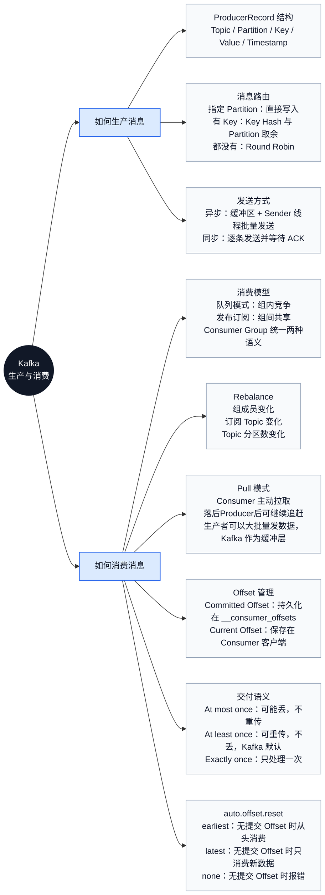

# Kafka从系统架构到生产消费的完整图谱

## Kafka 架构 {id="kafka_1"}

```mermaid
---
config:
  markdownAutoWrap: false
  flowchart:
    useMaxWidth: false
---
flowchart LR
    ROOT1(("Kafka<br/>架构")):::root

    ROOT1 --> BASE["基础模型"]:::topic
    BASE --> BASE_TOPIC["Topic 是逻辑分类"]:::detail
    BASE --> BASE_PARTITION["Partition 是物理分区和并行单位"]:::detail
    BASE --> BASE_REPLICA["Replica 是物理副本，保证 Partition 高可用"]:::detail
    BASE --> BASE_LEADER["Leader 提供对外读写能力，Follower 只是同步副本"]:::detail
    BASE --> BASE_OFFSET["Offset 标识 Partition 内的消息位置"]:::detail

    ROOT1 --> WHY["为什么使用 Kafka"]:::topic
    WHY --> WHY_DECOUPLE["消息队列解耦生产者和消费者"]:::detail
    WHY --> WHY_THROUGHPUT["高吞吐，适合实时日志流"]:::detail
    WHY --> WHY_DURABLE["磁盘持久化，数据不易丢"]:::detail
    WHY --> WHY_SCALE["分布式扩展 Broker 与 Partition"]:::detail

    ROOT1 --> FAST["为什么 Kafka 快"]:::topic
    FAST --> FAST_PARALLEL["Partition 并行<br/>生产消费围绕Partition展开<br/>Partition 数量决定并行上限"]:::detail
    FAST --> FAST_STORAGE["顺序 IO + Segment<br/>Partition 追加写<br/>LogSegment 按最小 Offset 命名"]:::detail
    FAST --> FAST_INDEX["Offset + 稀疏索引<br/>先二分查找定位 Segment<br/>再二分查 Index，找最近 offset<br/>最后顺序扫描 Log"]:::detail
    FAST --> FAST_CACHE["Page Cache<br/>依赖 OS 缓存<br/>减少 JVM 内存和 GC 压力<br/>生产消费速率接近时会形成读写空中接力"]:::detail
    FAST --> FAST_ZERO["Sendfile 零拷贝<br/>数据从Page Cache进入网络的发送路径<br/>减少用户态和内核态复制"]:::detail
    FAST --> FAST_COMPRESS["端到端批量压缩<br/>批次压缩后写入日志<br/>消费前保持压缩<br/>支持 GZIP / Snappy / LZ4"]:::detail

    ROOT1 --> HA["Kafka 高可用"]:::topic
    HA --> HA_REPLICA["Replica 分配<br/>Partition 与 Replica 均匀分布到 Broker<br/>Replica 数量不应超过 Broker 数量"]:::detail
    HA --> HA_ACK["ACK 可靠性<br/>Producer 等待 Broker 确认<br/>确认时机影响吞吐与可靠性"]:::detail
    HA --> HA_ISR["ISR 机制<br/>维护同步副本集合<br/>Follower 长时间落后被踢出 ISR<br/>Leader 故障后从 ISR 中选新 Leader<br/>所有 Follower 同步完成后，Leader 返回 ACK"]:::detail
    HA --> HA_ACK_LEVEL["acks 级别<br/>0：不等确认<br/>1：Leader 写入即确认<br/>all：ISR 同步后确认"]:::detail
    HA --> HA_RECOVER["故障恢复与可见性<br/>LEO 是每个副本末端 Offset<br/>HW 是所有副本最小 LEO<br/>HW 之前数据才对 Consumer 可见"]:::detail

    classDef root fill:#111827,color:#ffffff,stroke:#111827,stroke-width:2px;
    classDef topic fill:#dbeafe,color:#111827,stroke:#2563eb,stroke-width:1.5px;
    classDef detail fill:#f8fafc,color:#0f172a,stroke:#94a3b8,stroke-width:1px;
```

## Kafka 生产与消费 {id="kafka_2"}

## Q & A {id="kafka_3"}

<deflist collapsible="true">
    <def title="Broker、Topic、Partition、Leader、Follower 等概念之间的关系是怎样的？" default-state="inherited">
        
    </def>
    <def title="Topic 的分区结构与写入过程是怎样的？" default-state="inherited">
        
    </def>
    <def title="顺序IO跟随机IO在不同存储介质上的性能是怎样的？" default-state="inherited">
        
    </def>
    <def title="Topic 在磁盘上的目录文件结构是怎样的？" default-state="inherited">
        
下图即名为 “click” 的 Topic 在磁盘上的目录结构，它有3个 Partition。

        
        
一个 Partition 在磁盘上对应一个文件夹，里面通常包含多组文件，每组被称为一个日志段（LogSegment）。

        
一个日志段由多个文件组成：

        
<format style=",bold,italic" color="Pink"><code>.log</code> 日志文件，是实际存储消息体的文件；</format>

        
<format style=",bold,italic" color="LightBlue"><code>.index</code> 稀疏索引文件，建立了 “消息逻辑偏移量(Offset) → 消息物理磁盘位置” 的映射，用于快速定位消息；</format>

        
<format style=",bold,italic" color="LightSeaGreen"><code>.timeindex</code> 时间戳索引文件，建立了 “消息时间戳 → 消息逻辑偏移量(offset)” 的映射，方便按时间范围来查找消息。</format>

        <tip>
            段文件会根据段内最小 Offset 命名
        </tip>
    </def>
    <def title="如何根据 Offset 在日志文件中查找消息？" default-state="inherited">
        
以下图为例，查找 Offset 为 7 的 Message

        
        <procedure title="查找步骤" id="kafka-search-message-by-offset">
            <step>
                
因为 LogSegment 根据内部最小的 Offset 命名。

                
所以首先使用二分查找，确定 Message 在哪个 LogSegment 中。

            </step>
            <step>
                
打开 <code>.index</code> 稀疏索引文件，使用二分查找，找到最接近 Offset 7 且小于等于 Offset 7 的那个 Offset，本例为 Offset 6。

            </step>
            <step>
                
上一步已经知道 Offset 6 对应消息的物理位置为 9807，接下来打开 <code>.log</code> 文件，从 9807 的位置开始，顺序扫描，直到找到 Offset 7 对应的消息。本例中即物理位置 1108 这条消息。

            </step>
        </procedure>
    </def>
    <def title="Broker 中消息写入与持久化流程是怎样的？" default-state="inherited">
        
    </def>
    <def title="Kafka 为什么要把数据直接写到硬盘，而不是写到内存再 flush？" default-state="inherited">
        <list type="decimal">
            <li>
                
现代操作系统主动将所有空闲内存用作 disk caching, 所有对磁盘的读写操作都会通过这个统一的 cache。如果不使用直接I/O，该功能不能轻易关闭。

                
因此即使进程维护了 in-process cache，该数据也可能会被复制到操作系统的 Page Cache 中，事实上所有内容都被存储了两份。

            </li>
            <li>
                
Kafka 是建立在 jvm 上面的，jvm 有两个特点:

                <list>
                    <li>对象的内存开销非常高，通常是所存储的数据的两倍(甚至更多) </li>
                    <li>随着堆中数据的增加，Java 的垃圾回收变得越来越复杂和缓慢 </li>
                </list>
            </li>
            <li>简化代码，因为所有保持 cache 和文件系统之间一致性的逻辑现在都被放到了 OS 中，这样做比一次性的进程内缓存更准确、更高效。</li>
        </list>
    </def>
    <def title="Page Cache 的数据什么时候回写硬盘？" default-state="inherited">
        
Linux 内核里负责回写脏页的线程称为 flusher 线程。

        
flusher 线程运行时机：

        <list>
            <li>空闲内存低于某个阈值</li>
            <li>脏页停留时间高于某个阈值</li>
            <li>用户进程主动调用sync()或fsync()</li>
        </list>
        
进一步得出结论: 只要数据写进了 Page Cache，即使 Kafka 进程挂掉，数据也不会丢失

    </def>
    <def title="Page Cache 什么时候读取硬盘？" default-state="inherited">
        
当 Consumer 要消费的消息不在 Page Cache 里，才会去磁盘读取。

        
并且会顺便预读出一些相邻的块放入 Page Cache，以方便下一次读取。

        
进一步得出结论：如果 Producer 的生产速率与 Consumer 的消费速率相差不大，那么就能几乎只靠对 Page Cache 的读写完成整个生产-消费过程，磁盘访问非常少。这个结论俗称为“读写空中接力”。

    </def>
    <def title="Sendfile 零拷贝相比传统网络IO有何优势？" default-state="inherited">
        <procedure title="传统网络IO流程" id="kafka-classic-network-io">
            
            <step>
                
操作系统从磁盘读取数据到内核空间的 Page Cache。

            </step>
            <step>
                
应用程序读取内核空间的数据到用户空间的缓冲区。

            </step>
            <step>
                
应用程序将数据(用户空间的缓冲区)写回内核空间到套接字缓冲区(内核空间)。

            </step>
            <step>
                
操作系统将数据从套接字缓冲区(内核空间)复制到通过网络发送的 NIC 缓冲区。

            </step>
        </procedure>
        <procedure title="Sendfile 零拷贝" id="kafka-send-file">
            
            <step>
                
数据直接从 Page Cache 发送到网络，将IO操作全部交给操作系统，减少数据复制。

            </step>
        </procedure>
    </def>
</deflist>