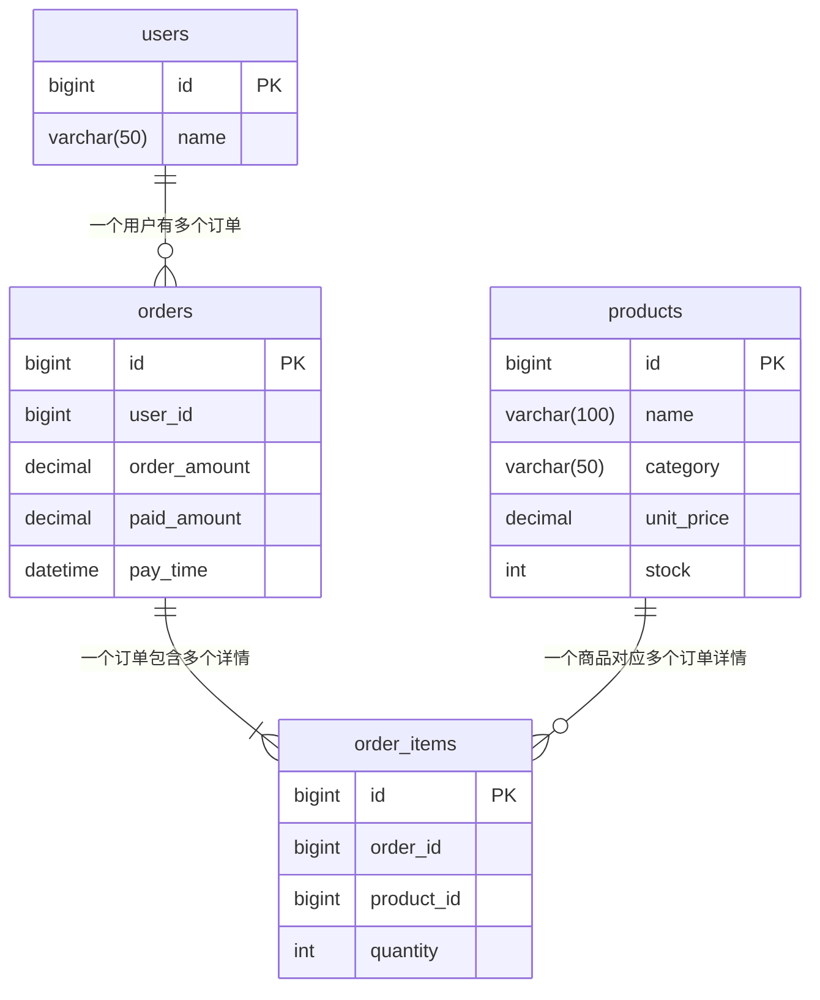

# 数据开发中的一些SQL经验总结
<show-structure depth="2"/>

声明：  
&emsp;&emsp;本篇博客不涉及任何SQL性能考虑，只是讨论在OLAP场景下的一些理论解决方法，用来解决日常生产开发中的一些常见需求。  
&emsp;&emsp;同时，为了精简篇幅，SQL全部使用了全表查询的写法，没有加任何过滤条件，请注意仔细甄别。

## 两张表之间，没有任何关联关系。按日期聚合统计时SQL该怎么写？ {id="sql_1"}
举个例子，假设有两张表，一张是放款表，一张是还款表。现在要求用一条SQL，统计出每日的放款金额和还款金额。

<tabs>
    <tab title="放款表">
        <code-block lang="sql">
            CREATE TABLE disburse (
                id BIGINT PRIMARY KEY AUTO_INCREMENT COMMENT '主键ID',
                disburse_date DATE NOT NULL COMMENT '放款日期',
                amount DECIMAL(15, 2) NOT NULL COMMENT '放款金额'
            ) ENGINE=InnoDB COMMENT='放款记录表';
        </code-block>
    </tab>
    <tab title="还款表">
        <code-block lang="sql">
            CREATE TABLE repay (
                id BIGINT PRIMARY KEY AUTO_INCREMENT COMMENT '主键ID',
                repay_date DATE NOT NULL COMMENT '还款日期',
                amount DECIMAL(15, 2) NOT NULL COMMENT '还款金额'
            ) ENGINE=InnoDB COMMENT='还款记录表';
        </code-block>
    </tab>
</tabs>

有两种写法，我简称为 横着写 或者 竖着写。 横着写就是用 `join`，竖着写就是用 `union all`，下面请看代码。

<tabs>
    <tab title="join写法（有坑）">
        <code-block lang="sql">
            SELECT a.stat_date, a.disburse_amount, b.repay_amount
            FROM (
                SELECT disburse_date AS stat_date, SUM(amount) AS disburse_amount
                FROM disburse
                GROUP BY disburse_date
            ) AS a 
            JOIN (
                SELECT repay_date AS stat_date, SUM(amount) AS repay_amount
                FROM repay
                GROUP BY repay_date
            ) b ON a.stat_date = b.stat_date;
        </code-block>
    </tab>
    <tab title="union all 写法">
        <code-block lang="sql">
            SELECT stat_date, SUM(disburse_amount) AS disburse_amount, SUM(repay_amount) AS repay_amount
            FROM (
                SELECT disburse_date AS stat_date, SUM(amount) AS disburse_amount, 0 AS repay_amount
                FROM disburse
                GROUP BY disburse_date
                UNION
                SELECT repay_date AS stat_date, 0 AS disburse_amount, SUM(amount) AS repay_amount
                FROM repay
                GROUP BY repay_date
            ) t
            GROUP BY stat_date;
        </code-block>
    </tab>
</tabs>

我为什么说这个 `join` 写法有坑呢？因为可能某天有放款但是没还款；或者反过来，有还款没放款。那么在用日期关联的时候，就可能会丢数据，不管你是把 `join` 改成 `left join` 还是 `right join` 都解决不了问题。

下面是针对这中 `join` 写法的两种优化版，解决了上述问题
<tabs>
    <tab title="join写法（再 join 一张日期表）">
        <code-block lang="sql">
            SELECT t.stat_date, IFNULL(a.disburse_amount, 0) AS disburse_amount, IFNULL(b.repay_amount, 0) AS repay_amount
            FROM (
                SELECT DISTINCT stat_date
                FROM (
                    SELECT disburse_date as stat_date FROM disburse
                    UNION ALL 
                    SELECT repay_date as stat_date FROM repay
                ) AS all_date 
            ) AS t
            LEFT JOIN (
                SELECT disburse_date AS stat_date, SUM(amount) AS disburse_amount
                FROM disburse
                GROUP BY disburse_date
            ) AS a ON t.stat_date = a.stat_date
            LEFT JOIN (
                SELECT repay_date AS stat_date, SUM(amount) AS repay_amount
                FROM repay
                GROUP BY repay_date
            ) b ON t.stat_date = b.stat_date;
        </code-block>
    </tab>
    <tab title="join写法（用 full join）">
        <code-block lang="sql">
            SELECT COALESCE(a.stat_date, b.stat_date) AS stat_date, IFNULL(a.disburse_amount, 0) AS disburse_amount, IFNULL(b.repay_amount, 0) AS repay_amount
            FROM (
                SELECT disburse_date AS stat_date, SUM(amount) AS disburse_amount
                FROM disburse
                GROUP BY disburse_date
            ) AS a 
            FULL JOIN (
                SELECT repay_date AS stat_date, SUM(amount) AS repay_amount
                FROM repay
                GROUP BY repay_date
            ) b ON a.stat_date = b.stat_date;
        </code-block>
    </tab>
</tabs>

&emsp;&emsp;第一种优化版写法，新加了一张全日期的日期表，作为主表，然后 `left join` 另外两个表。第二种写法是用 `full join`，即全外连接。<br/>
&emsp;&emsp;两种写法都有个弊端，那就是都会存在空值的情况，你可以看到我在 `SELECT` 中大量使用了 `COALESCE`、`IFNULL` 等函数对空值做特殊处理。  
而且在性能方面，两种写法都很糟糕。一个引入了一张额外的表，且写法很啰嗦。一种引入了 `full join`，这是一种性能很差的语法，且有些数据库不支持。<br/>
&emsp;&emsp;简而言之，遇到这种需求，`union all` 写法是最优解。

## 有转化关系的SQL该怎么写？ {id="sql_2"}

有转化关系的数据，意思就是各个统计字段间具有层级依赖特性，像个漏斗一样是分层的，每层数据都来自上层，但是一层比一层少。最经典的比如安装注册转化、曝光点击转化等。  

举个例子，假设有两张表，一张是安装表，一张是注册表，两张表用设备id关联，一个设备只有一个设备id，一个用户只有一个设备。  

现在要求用一条SQL，按日期统计安装数、24小时内注册数、T0注册数、T0(中午12点)注册数、T0(晚上6点)注册数、T1注册数、T30注册数。
<tabs>
    <tab title="安装表">
        <code-block lang="sql">
            CREATE TABLE install (
                id BIGINT PRIMARY KEY AUTO_INCREMENT COMMENT '主键ID',
                device_id VARCHAR(100) NOT NULL COMMENT '设备唯一标识',
                install_time DATETIME(6) NOT NULL COMMENT '安装时间（精确到微秒）'
            ) ENGINE=InnoDB COMMENT='安装表';
        </code-block>
    </tab>
    <tab title="注册表">
        <code-block lang="sql">
            CREATE TABLE register (
                id BIGINT PRIMARY KEY AUTO_INCREMENT COMMENT '用户ID/主键',
                device_id VARCHAR(100) NOT NULL COMMENT '设备唯一标识',
                register_time DATETIME(6) NOT NULL COMMENT '注册时间（精确到微秒）'
            ) ENGINE=InnoDB COMMENT='用户表';
        </code-block>
    </tab>
</tabs>

&emsp;&emsp;注册数是来自安装数，所以肯定小于等于安装数，就像漏斗一样。但是这个漏斗的出口是随着时间变化，越来越粗的。
所以这种需求一般都会要求一次性查看多个时期内的转化数据。比如上文提到的T0安装数，即用户安装当天即完成注册的数量；T1安装数，即用户安装当天或第二天完成注册的总数量。<br/>
&emsp;&emsp;一般遇到这种需求，没有经验的小白先不要慌（其实我当时已经有一点想骂街了）。他的核心解决思路，其实就是两表 `join` 后，<b>在 `CASE` 函数里用两个时间字段做对比。一个不变的时间，一个变化的时间。</b>
拿本例来说，不变的时间就是安装时间，变化的时间就是注册时间。下面请看代码

```SQL
    SELECT DATE(i.install_time) AS install_date,
    COUNT(DISTINCT i.device_id) AS install_num,
    COUNT(DISTINCT CASE WHEN TIMESTAMPDIFF(HOUR, i.install_time, r.register_time) BETWEEN 0 AND 24 THEN r.id ELSE NULL END) AS register_in_24hour,
    COUNT(DISTINCT CASE	WHEN DATEDIFF(DATE(r.register_time), DATE(i.install_time)) BETWEEN 0 AND 0 THEN r.id ELSE NULL END) AS register_t0,
    COUNT(DISTINCT CASE WHEN DATE(r.register_time) = DATE(i.install_time) AND TIME(r.register_time) < '12:00:00' THEN r.id ELSE NULL END) AS register_t0_before_12,
    COUNT(DISTINCT CASE WHEN DATE(r.register_time) = DATE(i.install_time) AND TIME(r.register_time) < '18:00:00' THEN r.id END) AS register_t0_before_18,
    COUNT(DISTINCT CASE	WHEN DATEDIFF(DATE(r.register_time), DATE(i.install_time)) BETWEEN 0 AND 1 THEN r.id ELSE NULL END) AS register_t1,
    COUNT(DISTINCT CASE	WHEN DATEDIFF(DATE(r.register_time), DATE(i.install_time)) BETWEEN 0 AND 30 THEN r.id ELSE NULL END) AS register_t30
    FROM install AS i
    LEFT JOIN register AS r ON i.device_id = r.device_id
    GROUP BY DATE(i.install_time)
```
因为数据库有着丰富的时间日期处理函数，所以理论上上面的写法会有多个变种，但是核心思路不会变。  
再进阶一点，上面的SQL是按日统计的，如果老板想按照周维度或者月维度去看这个报表，该怎么统计？其实简单换一下 `group by` 条件就好了，下面请看代码
<tabs>
    <tab title="周维度">
        <code-block lang="sql"><![CDATA[
            SELECT CONCAT(MIN(DATE(i.install_time)),"~",MAX(DATE(i.install_time))) AS install_date,
            COUNT(DISTINCT i.device_id) AS install_num,
            COUNT(DISTINCT CASE WHEN TIMESTAMPDIFF(HOUR, i.install_time, r.register_time) BETWEEN 0 AND 24 THEN r.id ELSE NULL END) AS register_in_24hour,
            COUNT(DISTINCT CASE	WHEN DATEDIFF(DATE(r.register_time), DATE(i.install_time)) BETWEEN 0 AND 0 THEN r.id ELSE NULL END) AS register_t0,
            COUNT(DISTINCT CASE WHEN DATE(r.register_time) = DATE(i.install_time) AND TIME(r.register_time) < '12:00:00' THEN r.id ELSE NULL END) AS register_t0_before_12,
            COUNT(DISTINCT CASE WHEN DATE(r.register_time) = DATE(i.install_time) AND TIME(r.register_time) < '18:00:00' THEN r.id END) AS register_t0_before_18,
            COUNT(DISTINCT CASE	WHEN DATEDIFF(DATE(r.register_time), DATE(i.install_time)) BETWEEN 0 AND 1 THEN r.id ELSE NULL END) AS register_t1,
            COUNT(DISTINCT CASE	WHEN DATEDIFF(DATE(r.register_time), DATE(i.install_time)) BETWEEN 0 AND 30 THEN r.id ELSE NULL END) AS register_t30
            FROM install AS i
            LEFT JOIN register AS r ON i.device_id = r.device_id
            GROUP BY YEARWEEK(i.install_time, 1);
        ]]>
        </code-block>
    </tab>
    <tab title="月维度">
        <code-block lang="sql"><![CDATA[
            SELECT DATE_FORMAT(install_time, '%Y-%m') AS install_date,
            COUNT(DISTINCT i.device_id) AS install_num,
            COUNT(DISTINCT CASE WHEN TIMESTAMPDIFF(HOUR, i.install_time, r.register_time) BETWEEN 0 AND 24 THEN r.id ELSE NULL END) AS register_in_24hour,
            COUNT(DISTINCT CASE	WHEN DATEDIFF(DATE(r.register_time), DATE(i.install_time)) BETWEEN 0 AND 0 THEN r.id ELSE NULL END) AS register_t0,
            COUNT(DISTINCT CASE WHEN DATE(r.register_time) = DATE(i.install_time) AND TIME(r.register_time) < '12:00:00' THEN r.id ELSE NULL END) AS register_t0_before_12,
            COUNT(DISTINCT CASE WHEN DATE(r.register_time) = DATE(i.install_time) AND TIME(r.register_time) < '18:00:00' THEN r.id END) AS register_t0_before_18,
            COUNT(DISTINCT CASE	WHEN DATEDIFF(DATE(r.register_time), DATE(i.install_time)) BETWEEN 0 AND 1 THEN r.id ELSE NULL END) AS register_t1,
            COUNT(DISTINCT CASE	WHEN DATEDIFF(DATE(r.register_time), DATE(i.install_time)) BETWEEN 0 AND 30 THEN r.id ELSE NULL END) AS register_t30
            FROM install AS i
            LEFT JOIN register AS r ON i.device_id = r.device_id
            GROUP BY DATE_FORMAT(install_time, '%Y-%m');
        ]]>
        </code-block>
    </tab>
</tabs>

## 多表关联时如何防止数据重复计算？ {id="sql_3"}

日常开发中经常会涉及到多表之间的 `join` 操作，但是 `join` 本身其实是有一点危险的，如果开发时没考虑到表与表之间的数量对应关系（比如一对多、多对多等），
就对导致数据膨胀，也就是重复计算。下面来看个例子

这是一个典型的电商场景，假设有四张表， 建表语句如下
<include from="公用sql代码片段.topic" element-id="e_commerce_system_table"></include>

这些表之间的对应关系如下


我们先来看一下测试数据，执行如下查询
```sql
SELECT o.order_amount, o.paid_amount, o.pay_time, oi.order_id, oi.product_id, 
       oi.quantity, p.`name`, p.category, p.unit_price
FROM orders AS o
JOIN order_items as oi ON o.id = oi.order_id
JOIN products as p ON oi.product_id = p.id
```
可以看到表中一共有2个订单：<br/>
订单1服装类金额为 $99.90*1=99.90$，总金额为9098.90，减掉优惠后用户实际支付金额为9000.00 <br/>
订单2服装类金额为 $99.90*2=199.80$，总金额为598.80，减掉优惠后用户实际支付金额为500.00

| order_amount | paid_amount | pay_time            | order_id | product_id | quantity | name          | category | unit_price |
|--------------|-------------|---------------------|----------|------------|----------|---------------|----------|------------|
| 9098.90      | 9000.00     | 2026-06-15 10:30:00 | 1        | 1          | 1        | iPhone 15 Pro | 电子产品     | 8999.00    |
| 9098.90      | 9000.00     | 2026-06-15 10:30:00 | 1        | 3          | 1        | 纯棉T恤          | 服装类      | 99.90      |
| 598.80       | 500.00      | 2026-06-16 14:20:00 | 2        | 5          | 1        | 运动鞋           | 鞋靴类      | 399.00     |
| 598.80       | 500.00      | 2026-06-16 14:20:00 | 2        | 3          | 2        | 纯棉T恤          | 服装类      | 99.90      |

如果现在要按日统计 **服装类购买金额占总订单金额的占比**，我们可以这样写
```SQL
SELECT DATE(o.pay_time) AS stat_date,
    sum(CASE WHEN p.category = "服装类" THEN p.unit_price*oi.quantity ELSE 0 END) /
    sum(p.unit_price*oi.quantity) AS rate
FROM orders AS o
    JOIN order_items as oi ON o.id = oi.order_id
    JOIN products as p ON oi.product_id = p.id
GROUP BY DATE(o.pay_time)
```
这里注意我的分母用的是 `sum(p.unit_price*oi.quantity)` 而不是 `sum(o.order_amount)`，因为如果用后者，那每个订单的总金额会计算多次。

为了让读者直观的感受到这种数据膨胀，我将两种分母的结果都计算了一遍，如下图，可以看到 `total_amount_2` 是 `total_amount_1` 的两倍。


因为本例中一条 `order` 记录关联了两条 `order_item` 记录，所以数据膨胀了两倍；如果关联 N 条 `order_item` 记录，那就会膨胀 N 倍，
最终计算出来的结果会远远偏移我们想要的目标。

那假如我们要按日统计 **服装类购买金额占总支付金额的占比** 呢？这时候分母没办法通过单价与数量运算得来，而只能使用 `paid_amount` 这个字段，那上面的 SQL
就不能使用了，同时还要避免数据重复计算，有没有什么好方法一条 SQL 写出来呢？

有的兄弟，有的

我们可以使用窗口函数 `row_number()`，用它来对一对多中的“多”做编号，同时在聚合时只计算编号为 1 的记录，即只计算一次，从而达到去重效果。
<tabs>
    <tab title="使用窗口函数去重（适用MySQL8.0以上版本）">
        <include from="公用sql代码片段.topic" element-id="windows_distinct_sql"></include>
    </tab>
    <tab title="使用非等值连接去重（适用MySQL低版本）">
        <code-block lang="sql"><![CDATA[            
            SELECT DATE(o.pay_time) AS stat_date,
            SUM(CASE WHEN p.category = '服装类' THEN p.unit_price * oi.quantity ELSE 0 END) /
            SUM(CASE WHEN oi.first_item = 1 THEN o.paid_amount ELSE 0 END) AS rate
            FROM orders AS o
            JOIN (
                SELECT a.order_id, a.product_id, a.quantity,
                CASE WHEN a.id = MIN(b.id) THEN 1 ELSE 0 END AS first_item
                FROM order_items a
                LEFT JOIN order_items b ON a.order_id = b.order_id AND a.id >= b.id
                GROUP BY a.order_id, a.product_id, a.quantity, a.id
            ) oi ON o.id = oi.order_id
            JOIN products AS p ON oi.product_id = p.id
            GROUP BY DATE(o.pay_time);]]>
        </code-block>
    </tab>
</tabs>

虽然 MySQL 低版本中不支持窗口函数，但是却可以通过**非等值连接**的写法来实现与 `row_number()` 一样的效果，对应的 SQL 我也贴在上面了。

**非等值连接**写法看起来可能比较绕，简单来说就是一张表 `join` 它自己，但是在 `on` 条件中用的是 `>=`、 `<=`、 `<`、 `<` 等非等号。
这个概念我最初是在《SQL进阶教程》这本书里看到的，当时感觉惊为天人，原来 SQL 还能这么写！

关于**非等值连接**本文后续就不再展开了，因为我写的肯定不如人家写得好。
这本书里也详细介绍了 `EXISTS` 的使用方法，非常推荐给想要提升自己数据开发技术的大家读一读。


## 当子查询太多，SQL变得不再优雅时该怎么办？ {id="sql_4"}

在我很长的一段职业生涯里，公司业务都是基于 MySQL5.7 构建的。所以每当遇到一些逻辑稍微复杂的报表，都会关联甚至嵌套很多子查询，冗长的SQL看起来实在不算优雅，
开发者头疼，其他维护者难以理解。

所以当我见到 CTE 这种细糠写法时，以后就再也不想用其他写法了。

CTE 简单来说就是用 `WITH` 语句创建的子查询视图，它只是临时存在，可供后续查询时引用，并在SQL执行结束时销毁。它的语法长这样 `WITH cte_name AS ( ... )`

我们可以用 CTE 写法来改造一下上面的窗口函数子查询版本SQL

<compare type="top-bottom" first-title="使用窗口函数去重（子查询）" second-title="使用窗口函数去重（CTE）">
<include from="公用sql代码片段.topic" element-id="windows_distinct_sql"></include>
<code-block lang="sql">
            WITH oi AS (
                SELECT order_id, product_id, quantity, 
                ROW_NUMBER() OVER(PARTITION BY order_id ORDER BY id asc) as rn
                FROM order_items
            ),
            oip AS (
                SELECT oi.*, 
                CASE WHEN p.category = "服装类" THEN p.unit_price*oi.quantity ELSE 0 END AS clothes_amount
                FROM oi JOIN products as p ON oi.product_id = p.id
            )
            SELECT DATE(o.pay_time) AS stat_date, 
            sum(oip.clothes_amount) / 
            sum(CASE WHEN oip.rn = 1 THEN o.paid_amount ELSE 0 END) AS rate
            FROM orders AS o 
            JOIN oip ON o.id = oip.order_id
            GROUP BY DATE(o.pay_time);
</code-block>
</compare>

可以看到，在使用 CTE 针对每个步骤做好阶段性视图后，最外层的 `SELECT` 语句变得异常简单。

CTE的优势有很多：

 - 提升复杂查询的可读性：将复杂的嵌套子查询拆解成有名字的 “步骤”，像写文章一样分段落，逻辑清晰。
 - 支持多次引用：同一个 CTE 可以在后续查询中被多次引用，避免重复编写相同的子查询。
 - 支持递归查询：这是 CTE 独有的能力（递归 CTE），适合查询树形或图形结构的数据，网上教程很多，本文就不再展开了。
 - 便于调试和维护：可以分步执行 CTE，排查问题更快；修改时只需改对应的 CTE 部分。

所以如果你的业务还是基于老版本 MySQL 构建的，是时候考虑一下升级了。

## 怎么用SQL解决快照问题？ {id="sql_5"}

### 什么是快照？ {id="sql_5_1"}
首先来简单理解一下什么是快照。我们以电商系统中常见的储值卡业务为例。

假设某电商平台支持储值卡。 用户可以购买一张储值卡，储值卡具有：`激活时间、失效时间、面值`等属性。

当用户使用储值卡购物时，会产生消费流水。

例如：

| 储值卡 | 激活时间  | 失效时间   | 面值 |
|--------|-----------|------------|-----:|
| A      | 1 月 1 日 | 1 月 10 日 |  100 |
| B      | 1 月 2 日 | 1 月 20 日 |  200 |

A 卡在 1 月 3 日消费了 30 元。

那么我们希望得到这样的日报：

| 统计日     | 有效储值余额 |
|------------|-------------:|
| 1 月 1 日  |          100 |
| 1 月 2 日  |          300 |
| 1 月 3 日  |          270 |
| 1 月 4 日  |          270 |
| …          |            … |
| 1 月 10 日 |          200 |
| 1 月 11 日 |          200 |

这里有一个非常重要的地方需要我们注意：

**这不是“当天发生了多少储值交易”，而是“当天 23:59:59 这个时间点，系统中还存在多少有效余额”。**

所以：

```text
日报流水 ≠ 时点快照
```

这两个概念看起来接近，但实现方式完全不同。

流水表达的是：**今天发生了什么？** 例如：今日新增储值、今日消费金额、今日失效金额等等，这些都是`Event / Transaction`。

快照表达的是：**截止今天 23:59:59，系统是什么状态？**，例如：今日有效储值余额等，这些是`State / Snapshot`。

如果用数学公式来表示两者关系的话，就是
```TeX
S(t) = S(0) + \sum_{i=1}^{t} \Delta(i)
```

再简化一下，就是
```TeX
S(t) = S(t-1) + \Delta(t)
```

其中 <math>S(t)</math> 是一个关于时间 t 的函数，表示第 t 天的快照。<math>\Delta(t)</math> 表示第 t 天发生的所有流水变化。

### 快照问题的抽象方法与解决思路 {id="sql_5_2"}

接下来分析一下快照问题的解决思路，以及如何对此类问题做更进一步的抽象。首先新建两张表：

<tabs>
    <tab title="储值卡表">
        <code-block lang="sql">
            CREATE TABLE `gift_card` (
              `id` bigint unsigned NOT NULL AUTO_INCREMENT COMMENT '储值卡ID',
              `user_id` bigint unsigned NOT NULL DEFAULT '0' COMMENT '用户ID',
              `activated_at` datetime NOT NULL DEFAULT CURRENT_TIMESTAMP COMMENT '激活时间',
              `expired_at` datetime NOT NULL DEFAULT CURRENT_TIMESTAMP COMMENT '失效时间',
              `face_value` decimal(18,2) NOT NULL DEFAULT '0.00' COMMENT '储值卡面值',
              PRIMARY KEY (`id`),
              KEY `idx_activated_at` (`activated_at`),
              KEY `idx_expired_at` (`expired_at`),
              KEY `idx_user_id` (`user_id`)
            ) ENGINE=InnoDB DEFAULT CHARSET=utf8mb4 COLLATE=utf8mb4_unicode_ci COMMENT='储值卡表';
        </code-block>
    </tab>
    <tab title="储值卡消费流水表">
        <code-block lang="sql">
            CREATE TABLE `gift_card_usage` (
              `id` bigint unsigned NOT NULL AUTO_INCREMENT COMMENT '消费流水ID',
              `gift_card_id` bigint unsigned NOT NULL DEFAULT '0' COMMENT '储值卡ID',
              `used_at` datetime NOT NULL DEFAULT CURRENT_TIMESTAMP COMMENT '消费时间',
              `amount` decimal(18,2) NOT NULL DEFAULT '0.00' COMMENT '消费金额',
              `status` varchar(20) NOT NULL DEFAULT 'SUCCESS' COMMENT '消费状态：SUCCESS-成功，FAILED-失败，PENDING-处理中',
              PRIMARY KEY (`id`),
              KEY `idx_gift_card_id` (`gift_card_id`),
              KEY `idx_status` (`status`),
              KEY `idx_used_at` (`used_at`)
            ) ENGINE=InnoDB DEFAULT CHARSET=utf8mb4 COLLATE=utf8mb4_unicode_ci COMMENT='储值卡消费流水表';
        </code-block>
    </tab>
</tabs>

接下来准备一些测试数据：

<tabs>
    <tab title="储值卡测试数据">
        <code-block lang="sql">
            INSERT INTO gift_card
            (id, user_id, activated_at, expired_at, face_value)
            VALUES
            (1, 1001, '2026-01-01 10:00:00', '2026-01-10 23:59:59', 100.00),
            (2, 1002, '2026-01-02 12:00:00', '2026-01-20 23:59:59', 200.00),
            (3, 1003, '2026-01-05 10:00:00', '2026-01-08 23:59:59', 150.00);
        </code-block>
    </tab>
    <tab title="消费流水测试数据">
        <code-block lang="sql">
            INSERT INTO gift_card_usage
            (id, gift_card_id, used_at, amount, status)
            VALUES
            (1, 1, '2026-01-03 15:00:00', 30.00, 'SUCCESS'),
            (2, 2, '2026-01-05 18:00:00', 50.00, 'SUCCESS'),
            (3, 3, '2026-01-06 11:00:00', 20.00, 'SUCCESS'),
            (4, 1, '2026-01-10 11:00:00', 20.00, 'SUCCESS');
        </code-block>
    </tab>
</tabs>

我们来整理一下思路，想一想，如果我们想查截至 2026-01-10 这天 23:59:59 的有效余额快照的话，那么首先，储值卡的“有效”状态该怎么定义？

伪代码应该是这样：
```Plain Text
激活时间 <= 统计时点 && 失效时间 > 统计时点
```

可以看到时间边界条件是左闭右开。

因为统计时点是一个时刻，即使是这个时刻激活的也应该算激活，同理，即使是这个时刻失效的也应该算失效。

所以我们定义“有效”时，就应该包括这个时刻已经激活的，而剔除这个时刻已经失效的。

最基础的“有效”定义已经好了，那么“有效余额”的定义就可以简化如下：
```Plain Text
有效余额 = 截至统计时点的有效储值卡的储值金额 - 截至统计时点的有效储值卡的已消费金额

```

进一步可抽象为：
```Plain Text
Snapshot(D) = 历史上截至 D 已经产生的资产 - 历史上截至 D 已经发生的消耗
```

这其实是一种非常通用的数据模型。一旦了解了时点快照（Point-in-Time Snapshot），很多报表都会变得很好理解。

例如：

<tabs>
    <tab title="电商系统">
        <code-block lang="plain text">
            每日有效库存快照
            每日有效优惠券快照
            每日有效储值余额快照
        </code-block>
    </tab>
    <tab title="会员系统">
        <code-block lang="plain text">
            每日有效会员数快照
            每日会员等级分布快照
            每日有效积分余额快照
        </code-block>
    </tab>
    <tab title="P2P系统">
        <code-block lang="plain text">
            每日应收余额快照
            每日应付余额快照
            每日未结清金额快照
        </code-block>
    </tab>
    <tab title="SaaS">
        <code-block lang="plain text">
            每日有效订阅数快照
            每日活跃合同数快照
            每日席位占用数快照
        </code-block>
    </tab>
</tabs>

它们表面上是不同业务，但背后的计算模型其实非常接近：

```Plain Text
在统计时点 D：
筛选已经生效的对象
排除已经结束的对象
累计截至 D 已发生的状态变化
最终得到 D 时刻的状态
```

所以快照问题的本质就是：**站在某个历史时间点上，把当时已经发生的事件重新拼起来，还原那个时间点的业务状态。**

### SQL 实践 {id="sql_5_3"}

我们来看两版 SQL，这两版 SQL 对于我们这个需求来说，都是正确答案。

<compare type="top-bottom" first-title="DATEDIFF 写法" second-title="DATEADD 写法">
<code-block lang="sql"><![CDATA[
            SELECT
                "2026-01-10",
                SUM(g.face_value) - COALESCE(SUM(u.used_amount), 0) AS active_balance
            FROM (
                SELECT id, face_value, activated_at, expired_at
                FROM gift_card
            ) g
            LEFT JOIN (
                SELECT gift_card_id, DATE(used_at) AS used_date, SUM(amount) AS used_amount
                FROM gift_card_usage
                WHERE status = 'SUCCESS'
                GROUP BY gift_card_id, DATE(used_at)
            ) u ON g.id = u.gift_card_id AND DATEDIFF(DATE(u.used_date), "2026-01-10") <= 0
            WHERE DATEDIFF(DATE(g.activated_at), "2026-01-10") <= 0
            AND DATEDIFF(DATE(g.expired_at), "2026-01-10") > 0;
        ]]>
</code-block>
<code-block lang="sql"><![CDATA[
            SELECT
                "2026-01-10",
                SUM(g.face_value) - COALESCE(SUM(u.used_amount), 0) AS active_balance
            FROM (
                SELECT id, face_value, activated_at, expired_at
                FROM gift_card
            ) g
            LEFT JOIN (
                SELECT gift_card_id, DATE(used_at) AS used_date, SUM(amount) AS used_amount
                FROM gift_card_usage
                WHERE status = 'SUCCESS'
                GROUP BY gift_card_id, DATE(used_at)
            ) u ON g.id = u.gift_card_id AND u.used_date < DATE_ADD(CAST("2026-01-10" AS DATETIME), INTERVAL 1 DAY)
            WHERE g.activated_at < DATE_ADD(CAST("2026-01-10" AS DATETIME), INTERVAL 1 DAY)
            AND g.expired_at >= DATE_ADD(CAST("2026-01-10" AS DATETIME), INTERVAL 1 DAY);
        ]]>
</code-block>
</compare>

我在这里更推荐 DATEADD 写法，因为 DATEADD 写法更符合时点快照的思想。

它用的是 `2026-01-10 24:00:00` 这个时刻作为统计基准，这个时刻与 `2026-01-11 00:00:00` 等价，即`DATE_ADD(CAST("2026-01-10" AS DATETIME), INTERVAL 1 DAY)`。

而 DATEDIFF 比较的是日期部分，不够灵活。如果需求改成统计 `2026-01-10 18:00:00` 这个时刻的快照，DATEDIFF 写法就完全不能用了。可是 DATEADD 写法稍加改造就能完美适配。

但是有一点需要注意，因为我们把基准时间往后调了一秒，所以不等号发生了变化，由 
```Plain Text
激活时间 <= 统计时点 && 失效时间 > 统计时点
```
变成了
```Plain Text
激活时间 < 统计时点+1s && 失效时间 >= 统计时点+1s
```

### 多日快照 SQL 怎么写 {id="sql_5_4"}

上面的 SQL 只能查询 `2026-01-10` 这天的快照，如果要查 `2026-01-08` 的快照，就只能手改 SQL 再跑一次。

那么能不能用一条 SQL 就能查出 `2026-01-01` 到 `2026-01-10` 的快照呢？可以这样写

```sql
    WITH date_list AS (
        SELECT '2026-01-01' AS stat_date
        UNION ALL
        SELECT '2026-01-02'
        UNION ALL
        SELECT '2026-01-03'
        UNION ALL
        SELECT '2026-01-04'
        UNION ALL
        SELECT '2026-01-05'
        UNION ALL
        SELECT '2026-01-06'
        UNION ALL
        SELECT '2026-01-07'
        UNION ALL
        SELECT '2026-01-08'
        UNION ALL
        SELECT '2026-01-09'
        UNION ALL
        SELECT '2026-01-10'
    )
    SELECT
        d.stat_date,
        SUM(g.face_value) - COALESCE(SUM(u.used_amount), 0) AS active_balance
    FROM date_list d
    CROSS JOIN (
        SELECT id, face_value, activated_at, expired_at
        FROM gift_card
    ) g ON g.activated_at < DATE_ADD(CAST(d.stat_date AS DATETIME), INTERVAL 1 DAY) AND g.expired_at >= DATE_ADD(CAST(d.stat_date AS DATETIME), INTERVAL 1 DAY)
    LEFT JOIN (
        SELECT gift_card_id, DATE(used_at) AS used_date, SUM(amount) AS used_amount
        FROM gift_card_usage
        WHERE status = 'SUCCESS'
        GROUP BY gift_card_id, DATE(used_at)
    ) u ON g.id = u.gift_card_id AND u.used_date <= d.stat_date
    GROUP BY d.stat_date
    ORDER BY d.stat_date;
```
不过，这个 SQL 虽然能表达思想，但还不是我最推荐的工程写法。

这里真正值得抽象的是：

```Plain Text
统计日期
    ×
业务对象
    ↓
判断对象在统计时点是否有效
    ↓
计算统计时点之前已经发生的消费
    ↓
得到统计时点状态
```

这类快照 SQL 中，经常会看到一个看起来有点暴力的操作：

```sql
CROSS JOIN date_list
```

原因其实很简单。假设有：

```Plain Text
3 张储值卡
10 个统计日
```
那么我们真正想判断的是：

```Plain Text
卡 A × 1 月 1 日
卡 A × 1 月 2 日
卡 A × 1 月 3 日
...

卡 B × 1 月 1 日
卡 B × 1 月 2 日
卡 B × 1 月 3 日
...

卡 C × 1 月 1 日
卡 C × 1 月 2 日
...
```
也就是说：
```Plain Text
业务对象 × 时间
```
然后逐个回答：**“这个对象在这个时间点到底是什么状态？”**

这种笛卡尔积带来的结果就是计算量的等比放大，这也是快照 SQL 很容易越写越慢的原因。

所以如果条件允许的话，还是建议读者直接维护一张快照表，每天计算增量快照即可。
即 <math>S(t-1)</math> 直接直接读取昨日保存结果，同时计算今日 <math>\Delta(t)</math>，最终得到今天的快照 <math>S(t) = S(t-1) + \Delta(t)</math>。

让我们用 CTE 将上面的 SQL 改成更为清晰一点的写法

```sql
    WITH date_list AS (
        SELECT '2026-01-01' AS stat_date
        UNION ALL SELECT '2026-01-02'
        UNION ALL SELECT '2026-01-03'
        UNION ALL SELECT '2026-01-04'
        UNION ALL SELECT '2026-01-05'
        UNION ALL SELECT '2026-01-06'
        UNION ALL SELECT '2026-01-07'
        UNION ALL SELECT '2026-01-08'
        UNION ALL SELECT '2026-01-09'
        UNION ALL SELECT '2026-01-10'
    ),
    card_snapshot AS (
        SELECT d.stat_date, g.id AS gift_card_id, g.face_value
        FROM date_list d
        CROSS JOIN gift_card g ON g.activated_at < DATE_ADD(CAST(d.stat_date AS DATETIME), INTERVAL 1 DAY) AND g.expired_at >= DATE_ADD(CAST(d.stat_date AS DATETIME), INTERVAL 1 DAY)
    ),
    usage_snapshot AS (
        SELECT d.stat_date, u.gift_card_id, SUM(u.amount) AS used_amount
        FROM date_list d
        CROSS JOIN gift_card_usage u ON u.used_at < DATE_ADD(CAST(d.stat_date AS DATETIME), INTERVAL 1 DAY) AND u.status = 'SUCCESS'
        GROUP BY d.stat_date, u.gift_card_id
    )
    SELECT
        c.stat_date,
        SUM(c.face_value) - COALESCE(SUM(u.used_amount), 0) AS active_balance
    FROM card_snapshot c
    LEFT JOIN usage_snapshot u ON c.stat_date = u.stat_date AND c.gift_card_id = u.gift_card_id
    GROUP BY c.stat_date
    ORDER BY c.stat_date;
```

这个 SQL 的可读性要好很多。

因为我们已经把问题拆成两个非常明确的步骤：

```Plain Text
card_snapshot
    ↓
这个日期上有哪些“有效储值卡”？

usage_snapshot
    ↓
截至这个日期，这些卡已经消费了多少钱？

最终：
有效面值 - 已消费金额
```

## 感谢阅读，未完待续。。。