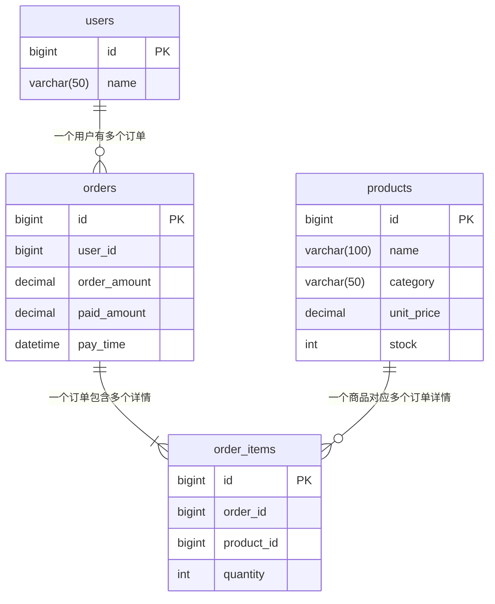

# 数据开发中的一些SQL经验总结

声明：  
&emsp;&emsp;本篇博客不涉及任何SQL性能考虑，只是讨论在OLAP场景下的一些理论解决方法，用来解决日常生产开发中的一些常见需求。  
&emsp;&emsp;同时，为了精简篇幅，SQL全部使用了全表查询的写法，没有加任何过滤条件，请注意仔细甄别。

## 两张表之间，没有任何关联关系。按日期聚合统计时SQL该怎么写？ {id="sql_1"}
举个例子，假设有两张表，一张是放款表，一张是还款表。现在要求用一条SQL，统计出每日的放款金额和还款金额。

<tabs>
    <tab title="放款表">
        <code-block lang="sql">
            CREATE TABLE disburse (
                id BIGINT PRIMARY KEY AUTO_INCREMENT COMMENT '主键ID',
                disburse_date DATE NOT NULL COMMENT '放款日期',
                amount DECIMAL(15, 2) NOT NULL COMMENT '放款金额'
            ) ENGINE=InnoDB COMMENT='放款记录表';
        </code-block>
    </tab>
    <tab title="还款表">
        <code-block lang="sql">
            CREATE TABLE repay (
                id BIGINT PRIMARY KEY AUTO_INCREMENT COMMENT '主键ID',
                repay_date DATE NOT NULL COMMENT '还款日期',
                amount DECIMAL(15, 2) NOT NULL COMMENT '还款金额'
            ) ENGINE=InnoDB COMMENT='还款记录表';
        </code-block>
    </tab>
</tabs>

有两种写法，我简称为 横着写 或者 竖着写。 横着写就是用 `join`，竖着写就是用 `union all`，下面请看代码。

<tabs>
    <tab title="join写法（有坑）">
        <code-block lang="sql">
            SELECT a.stat_date, a.disburse_amount, b.repay_amount
            FROM (
                SELECT disburse_date AS stat_date, SUM(amount) AS disburse_amount
                FROM disburse
                GROUP BY disburse_date
            ) AS a 
            JOIN (
                SELECT repay_date AS stat_date, SUM(amount) AS repay_amount
                FROM repay
                GROUP BY repay_date
            ) b ON a.stat_date = b.stat_date;
        </code-block>
    </tab>
    <tab title="union all 写法">
        <code-block lang="sql">
            SELECT stat_date, SUM(disburse_amount) AS disburse_amount, SUM(repay_amount) AS repay_amount
            FROM (
                SELECT disburse_date AS stat_date, SUM(amount) AS disburse_amount, 0 AS repay_amount
                FROM disburse
                GROUP BY disburse_date
                UNION
                SELECT repay_date AS stat_date, 0 AS disburse_amount, SUM(amount) AS repay_amount
                FROM repay
                GROUP BY repay_date
            ) t
            GROUP BY stat_date;
        </code-block>
    </tab>
</tabs>

我为什么说这个 `join` 写法有坑呢？因为可能某天有放款但是没还款；或者反过来，有还款没放款。那么在用日期关联的时候，就可能会丢数据，不管你是把 `join` 改成 `left join` 还是 `right join` 都解决不了问题。

下面是针对这中 `join` 写法的两种优化版，解决了上述问题
<tabs>
    <tab title="join写法（再 join 一张日期表）">
        <code-block lang="sql">
            SELECT t.stat_date, IFNULL(a.disburse_amount, 0) AS disburse_amount, IFNULL(b.repay_amount, 0) AS repay_amount
            FROM (
                SELECT DISTINCT stat_date
                FROM (
                    SELECT disburse_date as stat_date FROM disburse
                    UNION ALL 
                    SELECT repay_date as stat_date FROM repay
                ) AS all_date 
            ) AS t
            LEFT JOIN (
                SELECT disburse_date AS stat_date, SUM(amount) AS disburse_amount
                FROM disburse
                GROUP BY disburse_date
            ) AS a ON t.stat_date = a.stat_date
            LEFT JOIN (
                SELECT repay_date AS stat_date, SUM(amount) AS repay_amount
                FROM repay
                GROUP BY repay_date
            ) b ON t.stat_date = b.stat_date;
        </code-block>
    </tab>
    <tab title="join写法（用 full join）">
        <code-block lang="sql">
            SELECT COALESCE(a.stat_date, b.stat_date) AS stat_date, IFNULL(a.disburse_amount, 0) AS disburse_amount, IFNULL(b.repay_amount, 0) AS repay_amount
            FROM (
                SELECT disburse_date AS stat_date, SUM(amount) AS disburse_amount
                FROM disburse
                GROUP BY disburse_date
            ) AS a 
            FULL JOIN (
                SELECT repay_date AS stat_date, SUM(amount) AS repay_amount
                FROM repay
                GROUP BY repay_date
            ) b ON a.stat_date = b.stat_date;
        </code-block>
    </tab>
</tabs>

&emsp;&emsp;第一种优化版写法，新加了一张全日期的日期表，作为主表，然后 `left join` 另外两个表。第二种写法是用 `full join`，即全外连接。<br/>
&emsp;&emsp;两种写法都有个弊端，那就是都会存在空值的情况，你可以看到我在 `SELECT` 中大量使用了 `COALESCE`、`IFNULL` 等函数对空值做特殊处理。  
而且在性能方面，两种写法都很糟糕。一个引入了一张额外的表，且写法很啰嗦。一种引入了 `full join`，这是一种性能很差的语法，且有些数据库不支持。<br/>
&emsp;&emsp;简而言之，遇到这种需求，`union all` 写法是最优解。

## 有转化关系的SQL该怎么写？ {id="sql_2"}

有转化关系的数据，意思就是各个统计字段间具有层级依赖特性，像个漏斗一样是分层的，每层数据都来自上层，但是一层比一层少。最经典的比如安装注册转化、曝光点击转化等。  

举个例子，假设有两张表，一张是安装表，一张是注册表，两张表用设备id关联，一个设备只有一个设备id，一个用户只有一个设备。  

现在要求用一条SQL，按日期统计安装数、24小时内注册数、T0注册数、T0(中午12点)注册数、T0(晚上6点)注册数、T1注册数、T30注册数。
<tabs>
    <tab title="安装表">
        <code-block lang="sql">
            CREATE TABLE install (
                id BIGINT PRIMARY KEY AUTO_INCREMENT COMMENT '主键ID',
                device_id VARCHAR(100) NOT NULL COMMENT '设备唯一标识',
                install_time DATETIME(6) NOT NULL COMMENT '安装时间（精确到微秒）'
            ) ENGINE=InnoDB COMMENT='安装表';
        </code-block>
    </tab>
    <tab title="注册表">
        <code-block lang="sql">
            CREATE TABLE register (
                id BIGINT PRIMARY KEY AUTO_INCREMENT COMMENT '用户ID/主键',
                device_id VARCHAR(100) NOT NULL COMMENT '设备唯一标识',
                register_time DATETIME(6) NOT NULL COMMENT '注册时间（精确到微秒）'
            ) ENGINE=InnoDB COMMENT='用户表';
        </code-block>
    </tab>
</tabs>

&emsp;&emsp;注册数是来自安装数，所以肯定小于等于安装数，就像漏斗一样。但是这个漏斗的出口是随着时间变化，越来越粗的。
所以这种需求一般都会要求一次性查看多个时期内的转化数据。比如上文提到的T0安装数，即用户安装当天即完成注册的数量；T1安装数，即用户安装当天或第二天完成注册的总数量。<br/>
&emsp;&emsp;一般遇到这种需求，没有经验的小白先不要慌（其实我当时已经有一点想骂街了）。他的核心解决思路，其实就是两表 `join` 后，<b>在 `CASE` 函数里用两个时间字段做对比。一个不变的时间，一个变化的时间。</b>
拿本例来说，不变的时间就是安装时间，变化的时间就是注册时间。下面请看代码

```SQL
    SELECT DATE(i.install_time) AS install_date,
    COUNT(DISTINCT i.device_id) AS install_num,
    COUNT(DISTINCT CASE WHEN TIMESTAMPDIFF(HOUR, i.install_time, r.register_time) BETWEEN 0 AND 24 THEN r.id ELSE NULL END) AS register_in_24hour,
    COUNT(DISTINCT CASE	WHEN DATEDIFF(DATE(r.register_time), DATE(i.install_time)) BETWEEN 0 AND 0 THEN r.id ELSE NULL END) AS register_t0,
    COUNT(DISTINCT CASE WHEN DATE(r.register_time) = DATE(i.install_time) AND TIME(r.register_time) < '12:00:00' THEN r.id ELSE NULL END) AS register_t0_before_12,
    COUNT(DISTINCT CASE WHEN DATE(r.register_time) = DATE(i.install_time) AND TIME(r.register_time) < '18:00:00' THEN r.id END) AS register_t0_before_18,
    COUNT(DISTINCT CASE	WHEN DATEDIFF(DATE(r.register_time), DATE(i.install_time)) BETWEEN 0 AND 1 THEN r.id ELSE NULL END) AS register_t1,
    COUNT(DISTINCT CASE	WHEN DATEDIFF(DATE(r.register_time), DATE(i.install_time)) BETWEEN 0 AND 30 THEN r.id ELSE NULL END) AS register_t30
    FROM install AS i
    LEFT JOIN register AS r ON i.device_id = r.device_id
    GROUP BY DATE(i.install_time)
```
因为数据库有着丰富的时间日期处理函数，所以理论上上面的写法会有多个变种，但是核心思路不会变。  
再进阶一点，上面的SQL是按日统计的，如果老板想按照周维度或者月维度去看这个报表，该怎么统计？其实简单换一下 `group by` 条件就好了，下面请看代码
<tabs>
    <tab title="周维度">
        <code-block lang="sql"><![CDATA[
            SELECT CONCAT(MIN(DATE(i.install_time)),"~",MAX(DATE(i.install_time))) AS install_date,
            COUNT(DISTINCT i.device_id) AS install_num,
            COUNT(DISTINCT CASE WHEN TIMESTAMPDIFF(HOUR, i.install_time, r.register_time) BETWEEN 0 AND 24 THEN r.id ELSE NULL END) AS register_in_24hour,
            COUNT(DISTINCT CASE	WHEN DATEDIFF(DATE(r.register_time), DATE(i.install_time)) BETWEEN 0 AND 0 THEN r.id ELSE NULL END) AS register_t0,
            COUNT(DISTINCT CASE WHEN DATE(r.register_time) = DATE(i.install_time) AND TIME(r.register_time) < '12:00:00' THEN r.id ELSE NULL END) AS register_t0_before_12,
            COUNT(DISTINCT CASE WHEN DATE(r.register_time) = DATE(i.install_time) AND TIME(r.register_time) < '18:00:00' THEN r.id END) AS register_t0_before_18,
            COUNT(DISTINCT CASE	WHEN DATEDIFF(DATE(r.register_time), DATE(i.install_time)) BETWEEN 0 AND 1 THEN r.id ELSE NULL END) AS register_t1,
            COUNT(DISTINCT CASE	WHEN DATEDIFF(DATE(r.register_time), DATE(i.install_time)) BETWEEN 0 AND 30 THEN r.id ELSE NULL END) AS register_t30
            FROM install AS i
            LEFT JOIN register AS r ON i.device_id = r.device_id
            GROUP BY YEARWEEK(i.install_time, 1);
        ]]>
        </code-block>
    </tab>
    <tab title="月维度">
        <code-block lang="sql"><![CDATA[
            SELECT DATE_FORMAT(install_time, '%Y-%m') AS install_date,
            COUNT(DISTINCT i.device_id) AS install_num,
            COUNT(DISTINCT CASE WHEN TIMESTAMPDIFF(HOUR, i.install_time, r.register_time) BETWEEN 0 AND 24 THEN r.id ELSE NULL END) AS register_in_24hour,
            COUNT(DISTINCT CASE	WHEN DATEDIFF(DATE(r.register_time), DATE(i.install_time)) BETWEEN 0 AND 0 THEN r.id ELSE NULL END) AS register_t0,
            COUNT(DISTINCT CASE WHEN DATE(r.register_time) = DATE(i.install_time) AND TIME(r.register_time) < '12:00:00' THEN r.id ELSE NULL END) AS register_t0_before_12,
            COUNT(DISTINCT CASE WHEN DATE(r.register_time) = DATE(i.install_time) AND TIME(r.register_time) < '18:00:00' THEN r.id END) AS register_t0_before_18,
            COUNT(DISTINCT CASE	WHEN DATEDIFF(DATE(r.register_time), DATE(i.install_time)) BETWEEN 0 AND 1 THEN r.id ELSE NULL END) AS register_t1,
            COUNT(DISTINCT CASE	WHEN DATEDIFF(DATE(r.register_time), DATE(i.install_time)) BETWEEN 0 AND 30 THEN r.id ELSE NULL END) AS register_t30
            FROM install AS i
            LEFT JOIN register AS r ON i.device_id = r.device_id
            GROUP BY DATE_FORMAT(install_time, '%Y-%m');
        ]]>
        </code-block>
    </tab>
</tabs>

## 多表关联时如何防止数据重复计算？ {id="sql_3"}

日常开发中经常会涉及到多表之间的 `join` 操作，但是 `join` 本身其实是有一点危险的，如果开发时没考虑到表与表之间的数量对应关系（比如一对多、多对多等），
就对导致数据膨胀，也就是重复计算。下面来看个例子

这是一个典型的电商场景，假设有四张表， 建表语句如下
<include from="公用sql代码片段.topic" element-id="e_commerce_system_table"></include>

这些表之间的对应关系如下


我们先来看一下测试数据，执行如下查询
```sql
SELECT o.order_amount, o.paid_amount, o.pay_time, oi.order_id, oi.product_id, 
       oi.quantity, p.`name`, p.category, p.unit_price
FROM orders AS o
JOIN order_items as oi ON o.id = oi.order_id
JOIN products as p ON oi.product_id = p.id
```
可以看到表中一共有2个订单：<br/>
订单1服装类金额为 $99.90*1=99.90$，总金额为9098.90，减掉优惠后用户实际支付金额为9000.00 <br/>
订单2服装类金额为 $99.90*2=199.80$，总金额为598.80，减掉优惠后用户实际支付金额为500.00

| order_amount | paid_amount | pay_time            | order_id | product_id | quantity | name          | category | unit_price |
|--------------|-------------|---------------------|----------|------------|----------|---------------|----------|------------|
| 9098.90      | 9000.00     | 2026-06-15 10:30:00 | 1        | 1          | 1        | iPhone 15 Pro | 电子产品     | 8999.00    |
| 9098.90      | 9000.00     | 2026-06-15 10:30:00 | 1        | 3          | 1        | 纯棉T恤          | 服装类      | 99.90      |
| 598.80       | 500.00      | 2026-06-16 14:20:00 | 2        | 5          | 1        | 运动鞋           | 鞋靴类      | 399.00     |
| 598.80       | 500.00      | 2026-06-16 14:20:00 | 2        | 3          | 2        | 纯棉T恤          | 服装类      | 99.90      |

如果现在要按日统计 **服装类购买金额占总订单金额的占比**，我们可以这样写
```SQL
SELECT DATE(o.pay_time) AS stat_date,
    sum(CASE WHEN p.category = "服装类" THEN p.unit_price*oi.quantity ELSE 0 END) /
    sum(p.unit_price*oi.quantity) AS rate
FROM orders AS o
    JOIN order_items as oi ON o.id = oi.order_id
    JOIN products as p ON oi.product_id = p.id
GROUP BY DATE(o.pay_time)
```
这里注意我的分母用的是 `sum(p.unit_price*oi.quantity)` 而不是 `sum(o.order_amount)`，因为如果用后者，那每个订单的总金额会计算多次。

为了让读者直观的感受到这种数据膨胀，我将两种分母的结果都计算了一遍，如下图，可以看到 `total_amount_2` 是 `total_amount_1` 的两倍。


因为本例中一条 `order` 记录关联了两条 `order_item` 记录，所以数据膨胀了两倍；如果关联 N 条 `order_item` 记录，那就会膨胀 N 倍，
最终计算出来的结果会远远偏移我们想要的目标。

那假如我们要按日统计 **服装类购买金额占总支付金额的占比** 呢？这时候分母没办法通过单价与数量运算得来，而只能使用 `paid_amount` 这个字段，那上面的 SQL
就不能使用了，同时还要避免数据重复计算，有没有什么好方法一条 SQL 写出来呢？

有的兄弟，有的

我们可以使用窗口函数 `row_number()`，用它来对一对多中的“多”做编号，同时在聚合时只计算编号为 1 的记录，即只计算一次，从而达到去重效果。
<tabs>
    <tab title="使用窗口函数去重（适用MySQL8.0以上版本）">
        <include from="公用sql代码片段.topic" element-id="windows_distinct_sql"></include>
    </tab>
    <tab title="使用非等值连接去重（适用MySQL低版本）">
        <code-block lang="sql"><![CDATA[            
            SELECT DATE(o.pay_time) AS stat_date,
            SUM(CASE WHEN p.category = '服装类' THEN p.unit_price * oi.quantity ELSE 0 END) /
            SUM(CASE WHEN oi.first_item = 1 THEN o.paid_amount ELSE 0 END) AS rate
            FROM orders AS o
            JOIN (
                SELECT a.order_id, a.product_id, a.quantity,
                CASE WHEN a.id = MIN(b.id) THEN 1 ELSE 0 END AS first_item
                FROM order_items a
                LEFT JOIN order_items b ON a.order_id = b.order_id AND a.id >= b.id
                GROUP BY a.order_id, a.product_id, a.quantity, a.id
            ) oi ON o.id = oi.order_id
            JOIN products AS p ON oi.product_id = p.id
            GROUP BY DATE(o.pay_time);]]>
        </code-block>
    </tab>
</tabs>

虽然 MySQL 低版本中不支持窗口函数，但是却可以通过**非等值连接**的写法来实现与 `row_number()` 一样的效果，对应的 SQL 我也贴在上面了。

**非等值连接**写法看起来可能比较绕，简单来说就是一张表 `join` 它自己，但是在 `on` 条件中用的是 `>=`、 `<=`、 `<`、 `<` 等非等号。
这个概念我最初是在《SQL进阶教程》这本书里看到的，当时感觉惊为天人，原来 SQL 还能这么写！

关于**非等值连接**本文后续就不再展开了，因为我写的肯定不如人家写得好。
这本书里也详细介绍了 `EXISTS` 的使用方法，非常推荐给想要提升自己数据开发技术的大家读一读。


## 当子查询太多，SQL变得不再优雅时该怎么办？ {id="sql_4"}

在我很长的一段职业生涯里，公司业务都是基于 MySQL5.7 构建的。所以每当遇到一些逻辑稍微复杂的报表，都会关联甚至嵌套很多子查询，冗长的SQL看起来实在不算优雅，
开发者头疼，其他维护者难以理解。

所以当我见到 CTE 这种细糠写法时，以后就再也不想用其他写法了。

CTE 简单来说就是用 `WITH` 语句创建的子查询视图，它只是临时存在，可供后续查询时引用，并在SQL执行结束时销毁。它的语法长这样 `WITH cte_name AS ( ... )`

我们可以用 CTE 写法来改造一下上面的窗口函数子查询版本SQL

<compare first-title="使用窗口函数去重（子查询）" second-title="使用窗口函数去重（CTE）">
<include from="公用sql代码片段.topic" element-id="windows_distinct_sql"></include>
<code-block lang="sql">
            WITH oi AS (
                SELECT order_id, product_id, quantity, 
                ROW_NUMBER() OVER(PARTITION BY order_id ORDER BY id asc) as rn
                FROM order_items
            ),
            oip AS (
                SELECT oi.*, 
                CASE WHEN p.category = "服装类" THEN p.unit_price*oi.quantity ELSE 0 END AS clothes_amount
                FROM oi JOIN products as p ON oi.product_id = p.id
            )
            SELECT DATE(o.pay_time) AS stat_date, 
            sum(oip.clothes_amount) / 
            sum(CASE WHEN oip.rn = 1 THEN o.paid_amount ELSE 0 END) AS rate
            FROM orders AS o 
            JOIN oip ON o.id = oip.order_id
            GROUP BY DATE(o.pay_time);
</code-block>
</compare>

可以看到，在使用 CTE 针对每个步骤做好阶段性视图后，最外层的 `SELECT` 语句变得异常简单。

CTE的优势有很多：

 - 提升复杂查询的可读性：将复杂的嵌套子查询拆解成有名字的 “步骤”，像写文章一样分段落，逻辑清晰。
 - 支持多次引用：同一个 CTE 可以在后续查询中被多次引用，避免重复编写相同的子查询。
 - 支持递归查询：这是 CTE 独有的能力（递归 CTE），适合查询树形或图形结构的数据，网上教程很多，本文就不再展开了。
 - 便于调试和维护：可以分步执行 CTE，排查问题更快；修改时只需改对应的 CTE 部分。

所以如果你的业务还是基于老版本 MySQL 构建的，是时候考虑一下升级了。

### 未完待续。。。